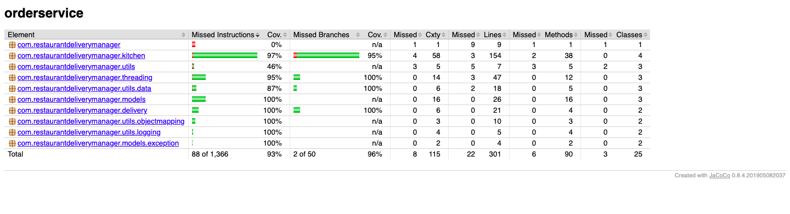

# Restaurant Order Delivery Service

Instructions to build:
mvn clean install

This application was developed with Visual Studio Code and JDK 11.
You can launch this application from the main method of entrypoint class by clicking the 'Run' method in VS Code.

# EntryPoint
   [RestaurantOrderEmulator](src/main/java/com/restaurantdeliverymanager/RestaurantOrderEmulator.java) is the entry point into the application which runs the emulator service

# Structure

 The application logic is split into the following main packages :
  - [Delivery](src/main/java/com/restaurantdeliverymanager/delivery) : Manages the delivery for the order
  - [Cloud Kitchen](src/main/java/com/restaurantdeliverymanager/kitchen) : Manages kitchen shelves and
  - [Models](src/main/java/com/restaurantdeliverymanager/models) : Contains the public interfaces
  - [Threading](src/main/java/com/restaurantdeliverymanager/threading): Contains the multithreading related helper classes
  - [Utils](src/main/java/com/restaurantdeliverymanager/utils) : Contains various helper classes related to reading data , logging etc

# Tweaking the parameters
Please change the following parameters to test for different load
- [INGESTION_RATE](src/main/java/com/restaurantdeliverymanager/utils/OrderServiceConstants.java) : Number of orders ingested into the system per second
- [DELIVERY_MIN_DELAY](src/main/java/com/restaurantdeliverymanager/utils/OrderServiceConstants.java): Minimum time for the delivery courier to arrive
- [DELIVERY_MAX_DELAY](src/main/java/com/restaurantdeliverymanager/utils/OrderServiceConstants.java): Minimum time for the delivery courier to arrive
- [ORDERS_FILE](src/main/java/com/restaurantdeliverymanager/utils/OrderServiceConstants.java) : Order file to read the orders from.

# Design Considerations

 - Mapper is structured in a way that it can be extended to perform Object Mapping from any source like CSV , TXT etc
 - DataReader has currently one implementation of FileReader but can be technically extended to even reading from a webservice to get the data
 - CloudKitchenShelfManager currently manages shelves with different temperatures , but this could be further extended to have different category of shelves based on other properties which implement the Property interface

# Further improvements

 - Logging currently happens in place but this can be outsourced to a class which has specific messages for different events like 'ORDER_ADD_TO_SHELF',
 'ORDER_REMOVE_FROM_SHELF', 'ORDER_DELIVERED' etc.
 - Fix Checkstyle errors in the application

 # CODE COVERAGE

 

